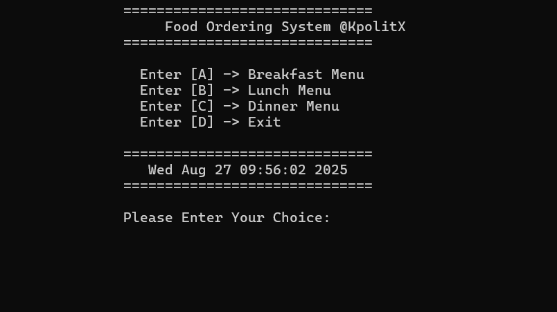
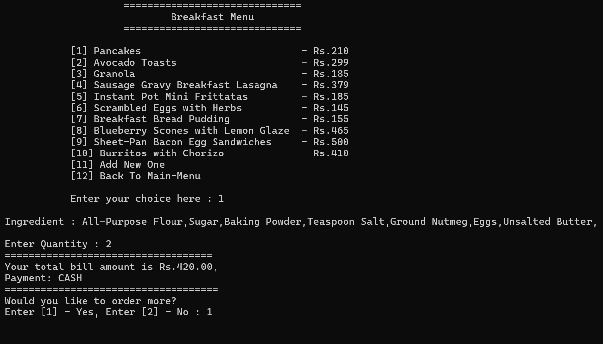

A mini project based on Food Ordering System which uses C Programming Language.


# Food-Ordering-System-C-

A mini project based on Food Ordering System which uses C Programming Language.


<p align="center">
<a href="https://www.w3schools.com/html/" target="_blank" rel="noreferrer">  </a> 
<a href="#" target="_blank" rel="noreferrer">  </a>
<a href="#" target="_blank" rel="noreferrer">  </a>
<a href="#" target="_blank" rel="noreferrer">  </a>
<a href="#" target="_blank" rel="noreferrer">  </a>
</p>


## 🔥 Features

- **Different Menu Lists.**
- **Container Numbers of Items according to menu set.**
- **Total bill calculations according to quantity ordered by the customers.**
- **Add food items.**
- **Display custom food items.**
- **Remove custom food items.**


## 📸 Preview

<table>
  <tr>
    <td></td>
    <td></td>
    <td></td>
  </tr>
  <tr>
    <td align="center">Home</td>
    <td align="center">Breckfast manu</td>
    <td align="center">Bill</td>
  </tr>
</table>

## 🚀 Clone

Clone the repository :

```sh
git clone https://github.com/DarkFeed2005/KFitX-Clothing-Website-PHP-MySQL-Bootstrap-.git
```
```bash
cd Clothing-Website
```


👨‍💻 Author
 
- Kalana Yasassri  <a href="https://github.com/DarkFeed2005" target="_blank" rel="noreferrer">  </a>
- LinkedIn <a href="https://www.linkedin.com/in/kalana-yasassri-684591251/" target="_blank" rel="noreferrer">  </a>
- Instagram <a href="https://www.instagram.com/kalana_yasassri/" target="_blank" rel="noreferrer">  </a> 
  
🎨 License
This project is open-source under the MIT License.
